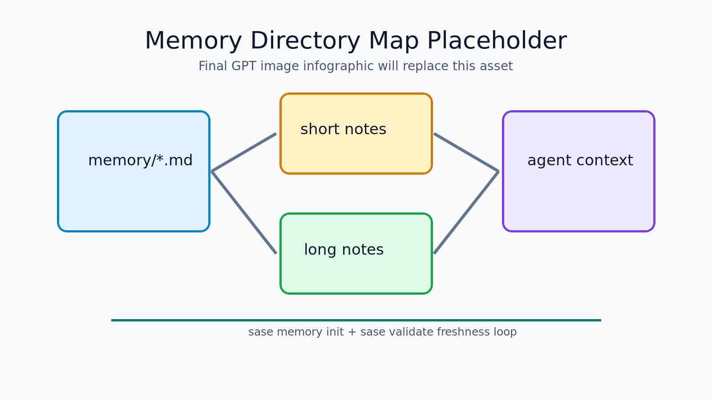

# SASE Memory

The `memory/` directory holds agent-facing project context. It separates compact, always-loaded notes from detailed
reference notes that agents read only when relevant.

## How Memory Files Are Used

- Non-README Markdown files live directly under `memory/` and use YAML frontmatter for `type`, `parent`, and
  `description`.
- `type: short` notes are Tier 1 context. `sase memory init` inlines them into `AGENTS.md`, then copies that exact
  content to each provider instruction shim.
- `type: long` notes are detailed reference material for Tier 2. They require a `description` and are fetched explicitly
  with audited `sase memory read` calls.
- `memory/sase.md` is generated from SASE configuration and captures linked repositories plus workspace rules.
- `memory/README.md` is generated from the notes themselves, including the statistics below.

### Frontmatter Schema

- `type`: `short` for always-loaded notes or `long` for read-on-demand reference notes.
- `parent`: `AGENTS.md` for top-level notes, or `memory/<note>.md` when a long note belongs under another long note.
- `description`: required for long notes and used in generated agent instructions and this README.

### Linking

- `@memory/<note>.md` loads a note into agent context when the root instruction file is read.
- Plain `memory/<note>.md` mentions keep a note discoverable without loading it automatically.
- Long notes parented under another long note are reachable through that parent for validation.

## Memory Notes

### `memory/sase.md`

- Type: `short`
- Description: No description set.
- Parent: `AGENTS.md`
- Lines: 26
- Approx. tokens: 351

### `memory/obsidian.md`

- Type: `long`
- Description: Obsidian vault, notes workflow, and obsidian-headless/ob usage.
- Parent: `AGENTS.md`
- Lines: 18
- Approx. tokens: 164

## Statistics

- Total notes: 2
- Short notes: 1
- Long notes: 1
- Total lines: 44
- Total approx. tokens: 515

## Commands

- `sase memory list` shows loaded, referenced, available, and missing memory files.
- `sase memory init` creates or refreshes generated memory files, renders `AGENTS.md` and provider shims from
  `AGENTS.template.md`, and refreshes this asset-backed README.
- Set `amd_agents_template` (or `amd_agents_minimal_template`) to a root-relative project template in `sase.yml`; home
  roots can instead use `AGENTS.template.md` (or `AGENTS.minimal.template.md`) in the SASE user config directory.
- Set `memory_sase_template` or `memory_readme_template` to root-relative project templates in `sase.yml`; home roots
  can instead use `memory-sase.template.md` or `memory-README.template.md` in the SASE user config directory.
- `sase memory init --check` reports drift without writing files.
- `sase memory read <note>.md --reason <reason>` reads a long note and records an audited access event.
- `sase memory write` proposes a new long-term memory note for review.
- `sase memory review` reviews pending memory proposals.
- `sase memory log` summarizes audited long-memory reads.
